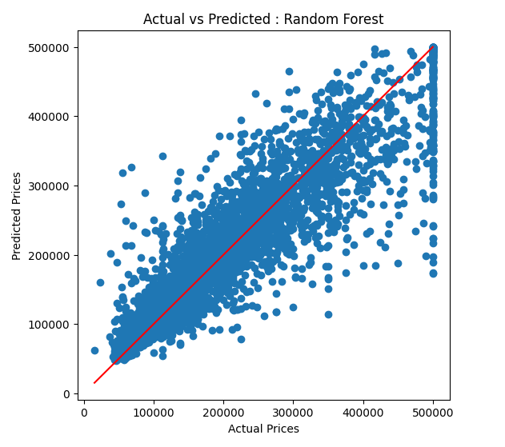
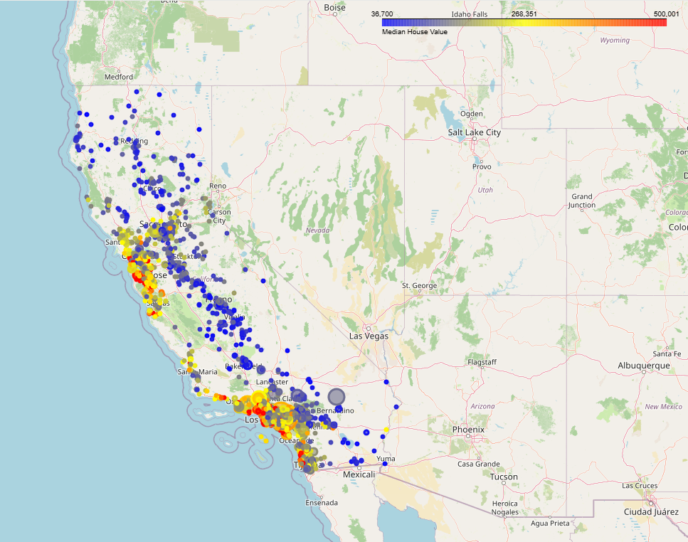
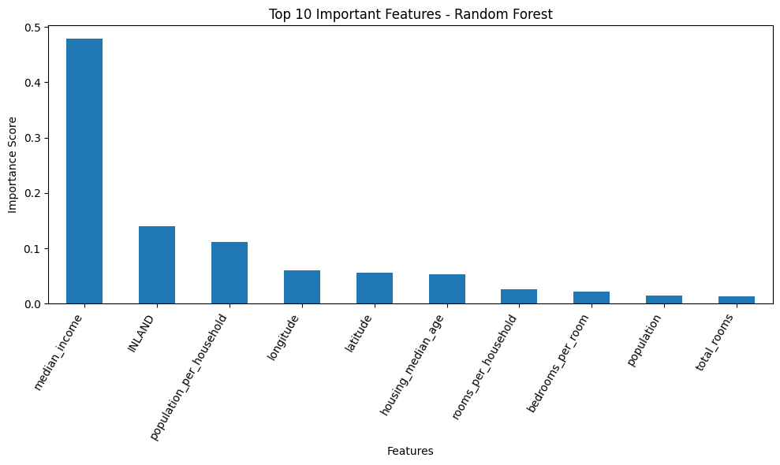

# Housing Valuation & Market Intelligence Analytics

## Overview

This project develops a **housing valuation and market analytics system** using California housing data to estimate median house values and analyse the main factors influencing housing prices.

The analysis combines **exploratory analytics, feature engineering, machine learning modelling, and model interpretation** to understand how economic, geographic, and housing characteristics affect property valuation.

The project aims to support more informed decision making for **real estate analysis, pricing evaluation, and housing market understanding**.

Dataset Used: [California Housing Dataset](https://www.kaggle.com/datasets/camnugent/california-housing-prices)

## Business Problem

Accurate property valuation is challenging because house prices depend on multiple interacting factors such as:

* income levels
* housing characteristics
* population patterns
* geographic location

This project addresses the problem by building a machine learning based valuation model and analysing the key drivers behind housing price behaviour.

## Approach

**Data Quality Audit → Data Cleaning → Exploratory Analysis → Feature Engineering → Model Development → Evaluation → Insights**

Key analytical steps included:

* Missing value analysis and treatment
* Correlation and geographic pattern analysis
* Feature engineering using housing density ratios
* Comparison of linear and tree based machine learning models
* Residual analysis and cross validation for model reliability assessment
* Feature importance analysis to interpret model behaviour

## Tech Stack

**Programming & Analysis:** Python, Pandas, NumPy  

**Visualisation:** Matplotlib, Seaborn, Folium (Geographic Mapping)  

**Machine Learning:** Scikit-learn

## Models Used

* Linear Regression
* Random Forest Regressor
* Gradient Boosting Regressor

## Model Performance

| Model             | R² Score | RMSE   | MAE    |
| ----------------- | -------- | ------ | ------ |
| Linear Regression | 0.67     | 67,068 | 48,564 |
| Random Forest     | 0.81     | 50,768 | 33,064 |
| Gradient Boosting | 0.79     | 54,214 | 37,382 |

### Evaluation Insights

* Random Forest achieved the strongest overall performance across all evaluation metrics.
* Tree based models consistently outperformed Linear Regression.
* Results suggest that housing prices depend on complex and non linear feature relationships.

Cross Validation (Random Forest)

**Average R² Score: 0.80**

The model maintained stable performance across multiple folds, suggesting reliable generalisation across different subsets of the dataset.

> The visual below compares actual prices with model predictions for the final Random Forest model.  
`Points closer to the diagonal line indicate stronger prediction accuracy.`

## Key Analytical Insights

* **Median income** emerged as one of the strongest drivers of house price prediction.
* Housing valuation depends on a combination of **income, location, population, and housing structure**, not a single variable.
* Engineered features such as housing density ratios added useful pricing information beyond raw counts.
* Geographic analysis revealed visible regional differences in housing prices across California.

## Feature Importance Analysis

Understanding which variables drive predictions is important for model interpretation and practical decision making.

The Random Forest model identifies the features most used during house price estimation.

Median income emerged as a major pricing driver, while location related and housing structure variables also contributed meaningfully to prediction.

## Business Impact

This project demonstrates how machine learning and analytics can support:

* **Real Estate Firms** → property valuation and pricing analysis
* **Buyers & Sellers** → understanding fair housing value
* **Financial Institutions** → property related risk assessment
* **Policy Teams & Researchers** → housing trend and regional market analysis

## Project Highlights

* Built an end to end housing valuation workflow from data preparation to model interpretation.
* Applied feature engineering and model comparison to improve predictive performance.
* Performed residual analysis and cross validation to evaluate model stability.
* Combined machine learning results with analytical insights for practical decision support.

Project by [**Anurag Chauhan**](https://www.linkedin.com/in/theanuragchauhan/)
